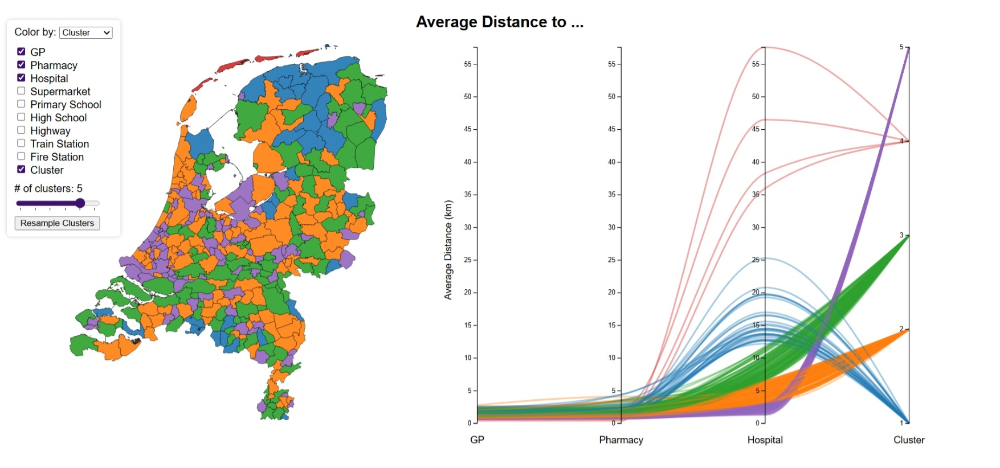
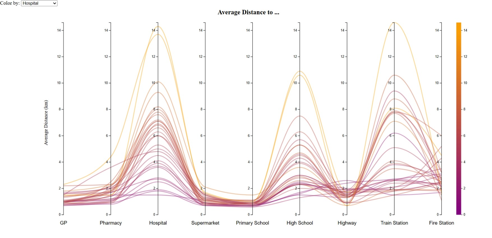

# 'Nabijheid Voorzieningen' Data Visualization
 

The [Nabijheid voorzieningen; afstand locatie, regionale cijfers](https://opendata.cbs.nl/#/CBS/nl/dataset/80305ned/table?ts=1762443943511) dataset from the CBS contains information on average distances to common facilities such as hospitals, schools, train stations etc. for Dutch municipalities.
This project creates a visualization of a subset of the 2023 version of this dataset using the [D3](https://d3js.org/) JavaScript library.
The following features are considered:

- Population
- Avg. Distance to Closest GP
- Avg. Distance to Closest Pharmacy
- Avg. Distance to Closest Hospital
- Avg. Distance to Closest Supermarket
- Avg. Distance to Closest Primary School
- Avg. Distance to Closest High School
- Avg. Distance to Closest Highway
- Avg. Distance to Closest Train Station
- Avg. Distance to Closest Fire Station

Spatial data is taken from the [Wijk- en buurtkaart 2023](https://www.cbs.nl/nl-nl/dossier/nederland-regionaal/geografische-data/wijk-en-buurtkaart-2023) shape file from the CBS.
The final processed dataset consists of 13 features and 342 municipalities (see `/data`).

### Usage
To start the visualization, run `npm start` in the terminal.

### About
Developed by Thomas Vroom, Maastricht University (2025), as part of the KEN4224 Data Visualization course.
